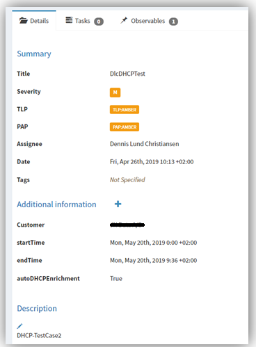
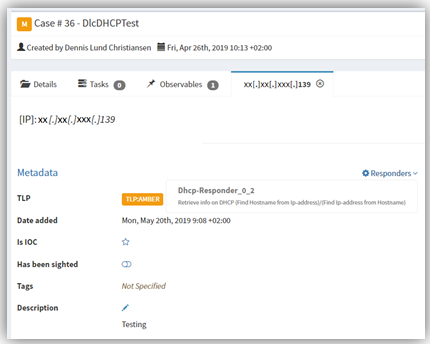
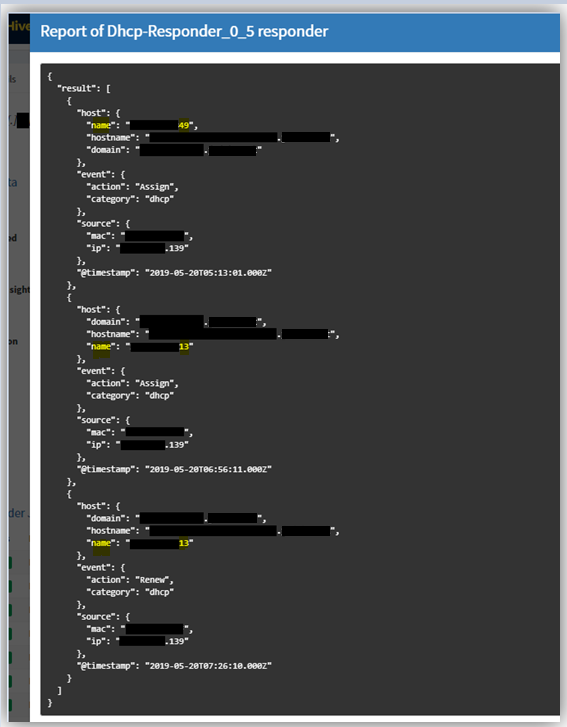
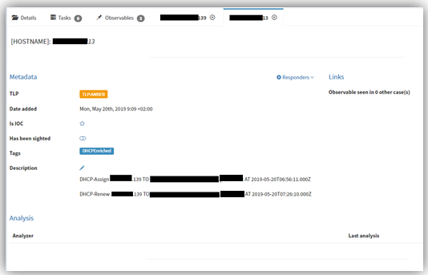
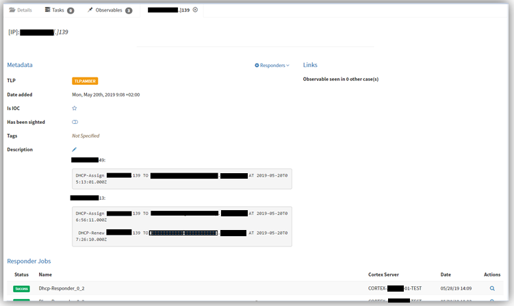

# ElasticSearch-Cortex_Responder

This is my attempt at enriching events in TheHive, with information from ElasticSearch.

### Short intro

This responder was made with the purpose of helping correlate ip-addresses with hostnames in a large infrastructure, using dynamic DHCP.

Besides being able to fetch the relevant log-entries form our DHCP-logs in Elastic, This responder is also able to perform automatic enrichment of the event, Meaning, that the responder can create new observables, containing relevant info in the message-field.

### Prerequisites

When implementing this responder the following should be implemented in TheHive:

    Datatype: hostname      (fqdn could be used instead as it already exist in TheHive, but this would require a few small changes to the responder)
    
    CustomField: customer(string)   (used to define which ElasticSearch-index should be searched.)
    
    CustomField: startTime(timestamp)  (Used to define the start of the time-period you want logs from. Default is datetime.now - 24hours)
    
    CustomField: endTime(timestamp)    (Used to define the end of the time-period you want logs from. Default is datetime.now)

    CustomField: autoDHCPEnrichment(Boolean)    (Defines if Responder should perform automatic enrichment)

Furthermore your DHCP logs should adhere to the Elastic-Common-Schema.

### Use-Case

This Responder works on case-artifacts and supports the following datatypes:
    Ip-address (must be rfc1918 (LAN) compliant)
    FQDN
    hostname
    other(if using other, it is assumed that the observable is a hostname)

The analyst starts by adding the required customFields(Customer, startTime, endTime, autoDHCPEnrichment)

The analyst then run the Responder on (usually an Ip-address) observable

If autoDHCPEnrichment is set to false, the responder will only return a report looking something like this:

If autoDHCPEnrichment is set to true, the responder will create a new (hostname) observable per hostname returned from Elastic.
These new observables, will also contain a small report in the messageField

The original (IP-address) observable will also be enriched with a small report in the messageField

### Extensions

I have tried to make the Responder somewhat modular, which means that it should be somewhat simple to expand with further information.
For example, I have allready created a POC, where I do further enrichment to the hostname observables, by adding information from our CMDB (such as OS, LastLoggedOnUser, domain, manufactorer, mac, serial, etc.).
